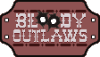

# WGD1 - Group Z Project
# Bloody Outlaws

Project for the Web Games Dev 1 Course

---

An Arcade Shooting-Gallery web game made with [Phaser](https://phaser.io/).

Stylised in pixel-art and in widescreen.

by [Taylor Moon](https://github.com/TaylorMN) & [Tembani Mdaya](https://github.com/tj3k)

Screenshots :

