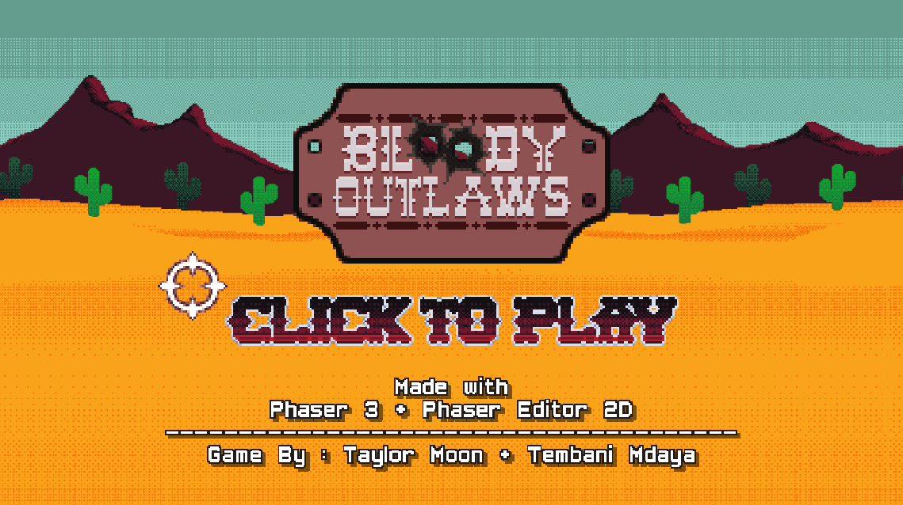
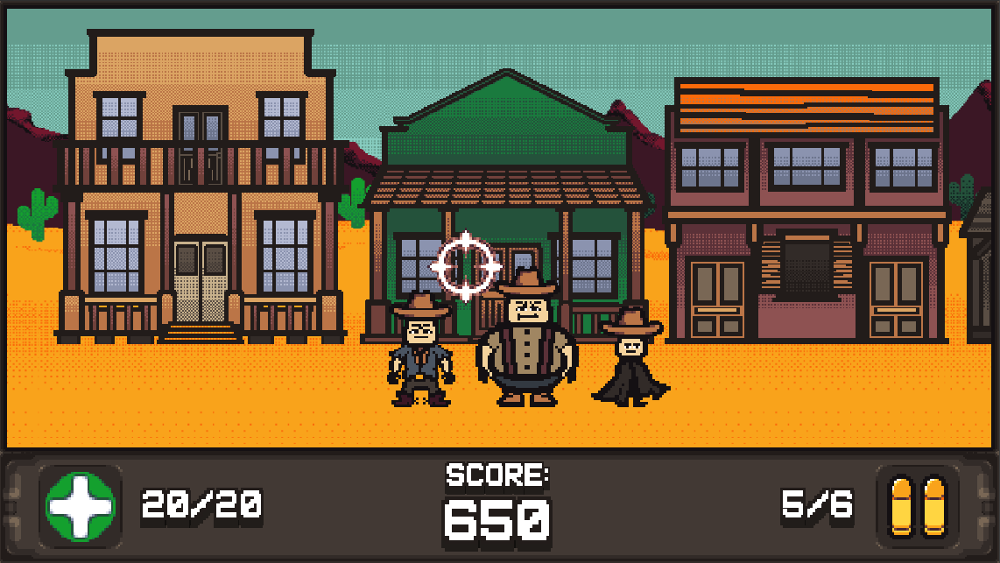
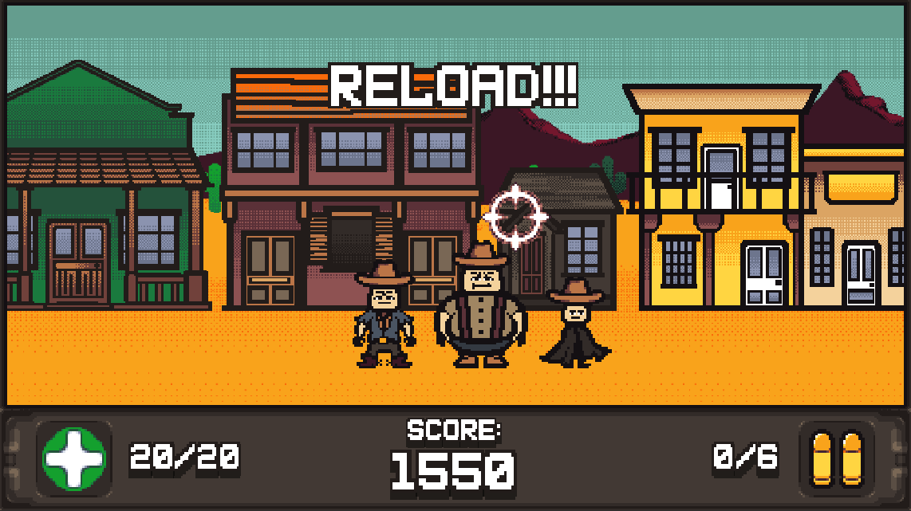

# WGD1 - Group Z Project
# Bloody Outlaws

Project for the Web Games Dev 1 Course

---

A Western-Themed, Arcade Shooting-Gallery web game made with [Phaser](https://phaser.io/).

Stylised in pixel-art and in widescreen.

by [Taylor Moon](https://github.com/TaylorMN) & [Tembani Mdaya](https://github.com/tj3k)

[ArtStation Link](https://www.artstation.com/artwork/NGBw8J) for a behind the scenes look at art and concept art.
[

Screenshots :

